 

  

---

## 👨‍💻 About Me

- 🎓 **B.E. Computer Science & Engineering** student with a specialized focus on **Data Engineering & Analytical Systems**.
- 🛠️ Engineering robust data flows: from IoT sensor ingestion and columnar Parquet lakes to relational data modeling and executive business intelligence.
- 📐 Strong emphasis on **Data Contracts, Schema Validation, Deterministic Data Quality, and SQL Safety**.
- 🤖 Integrating **Applied AI** (LLMs, agents, RAG, computer vision) as a powerful layer on top of solid data engineering foundations.

---

## 🛠️ Verified Technical Stack

### Core Data Engineering & Databases

### Analytics, Business Intelligence & Modeling

### Applied AI & Supporting Technologies

---

## 🏗️ End-to-End Data Engineering Journey

My projects connect into a coherent data engineering lifecycle:

```mermaid
flowchart LR
    A[Raw Data Sources<br>IoT, CSV, JSON, Transducers] --> B[Validation & Ingestion<br>Bounds, Contracts, Duplicates]
    B --> C[Processing & Normalization<br>PyArrow, Cleaners, DuckDB]
    C --> D[Storage & Modeling<br>Parquet Lake, PostgreSQL, Star Schema]
    D --> E[Analytics & Intelligence<br>Power BI, DAX, KPI Engines]
    E --> F[AI-Assisted Consumption<br>NL-to-SQL, LLM Agents, RAG]

    click B "https://github.com/DHARINEESHRK/aquaflow-smart-irrigation-data-engineering" "AquaFlow"
    click C "https://github.com/DHARINEESHRK/LexAi-Dataset" "LexAI Dataset"
    click D "https://github.com/DHARINEESHRK/Brazilian-Ecommerce-PowerBI-Dashboard" "Power BI Dashboard"
    click F "https://github.com/DHARINEESHRK/Ai-Data_Analytics" "QueryLens"
```

---

## 🚀 Featured Flagship Projects

<table>

<tr>
<td width="50%" valign="top">

### 🔍 [QueryLens — AI Data Analyst Agent](https://github.com/DHARINEESHRK/Ai-Data_Analytics)
**Primary Flagship | Data Engineering & Applied AI**

An end-to-end analytical platform that converts natural language business inquiries into validated SQL queries, executions, dynamic visualizations, and explanations.

- **Data Engineering**: Formal **Data Contracts (v1.0.0)**, Parquet columnar ingestion, read-only SQL AST execution guards.
- **Data Quality**: 6-rule deterministic data quality validation engine.
- **Testing & Observability**: 67 automated backend tests passing (100%), execution duration tracking, and query explainability.
- **Tech Stack**: Python, FastAPI, DuckDB, Parquet, PyArrow, NVIDIA NIM, Docker.

</td>
<td width="50%" valign="top">

### 🌱 [AquaFlow — IoT Telemetry Pipeline](https://github.com/DHARINEESHRK/aquaflow-smart-irrigation-data-engineering)
**Secondary Flagship | IoT Data Engineering**

A real-time telemetry ingestion and analytics pipeline processing physical environmental observations from ESP8266 microcontroller transducers.

- **Data Engineering**: Deterministic transducer bounds validation, future timestamp guards, idempotent deduplication `(device_id, recorded_at)`.
- **Relational Persistence**: Clean SQLAlchemy schema for devices, observations, and actuators with PostgreSQL/SQLite toggle.
- **Analytics API**: Time-series rolling aggregations, daily minimum/maximum/average statistics, and dashboard data feeds.
- **Tech Stack**: Python, FastAPI, PostgreSQL, SQLite, SQLAlchemy, Docker Compose.

</td>
</tr>

<tr>
<td width="50%" valign="top">

### 📊 [Brazilian E-Commerce Power BI Dashboard](https://github.com/DHARINEESHRK/Brazilian-Ecommerce-PowerBI-Dashboard)
**Analytics Flagship | Dimensional Modeling & BI**

Executive-grade Power BI dashboard analyzing 100,000+ orders from the Brazilian marketplace Olist across sales, customer cohorts, and merchandise velocity.

- **Data Modeling**: **Fact Constellation Schema** separating multi-item orders and split payments from conformed customer/product/seller dimensions.
- **DAX Architecture**: 14 production DAX measures utilizing safe division, filter context modifications, and customer retention segmentation.
- **Automated Validation**: Python audit suite verifying 550,688 transactional records with **0 primary key** and **0 foreign key violations**.
- **Tech Stack**: Microsoft Power BI, DAX, Power Query, Dimensional Modeling, Python.

</td>
<td width="50%" valign="top">

### ⚖️ [LexAI Dataset & Parquet Engine](https://github.com/DHARINEESHRK/LexAi-Dataset)
**Dataset Engineering | Columnar Storage**

A production-grade, normalized legal corpus comprising 29,994 statutory documents, 855 central Acts, and 10,000 Supreme Court QA pairs.

- **Dataset Engineering**: Schema normalization, data dictionary (`DATA_SCHEMA.md`), and automated data validation across 79,988 records.
- **Columnar Transformation**: Automated PyArrow Parquet conversion pipeline with ZSTD compression achieving **84.7% storage reduction** (140.5 MB $\rightarrow$ 21.47 MB).
- **High Throughput**: 5x scan speedup, reading all 29,994 documents in **0.20 seconds**.
- **Tech Stack**: Python, PyArrow, Apache Parquet, ZSTD, Pandas, Schema Validation.

</td>
</tr>

<tr>
<td width="50%" valign="top">

### 👁️ [Helmet Detection Computer Vision](https://github.com/DHARINEESHRK/Helmet_Detection)
**Applied AI | Deep Learning Inference**

Real-time motorcycle helmet safety compliance detection pipeline utilizing YOLOv8 and Roboflow computer vision models to identify traffic safety violations from video feeds.

- **Tech Stack**: Python, YOLOv8, OpenCV, Deep Learning, Roboflow.

</td>
<td width="50%" valign="top">

### 📈 [Retail Sales Analytics Dashboard](https://github.com/DHARINEESHRK/Sales-Analytics-Dashboard-Excel)
**Business Analytics | Spreadsheet Modeling**

Interactive omnichannel retail sales dashboard analyzing 500 transaction records across 5 online marketplaces, demographic segments, and geographic regions.

- **Tech Stack**: Microsoft Excel, PivotTables, Dynamic Slicers, Python Validator.

</td>
</tr>

</table>

---

## 📚 Currently Learning & Next Engineering Focus

I believe in continuous, deliberate improvement. These are the specific enterprise distributed technologies I am actively building projects with next:

| Technology | Focus Area | Goal |
| :--- | :--- | :--- |
| **Apache Airflow** | Workflow Orchestration | Scheduling DAGs, sensor triggers, and automated data pipeline monitoring |
| **Apache Kafka** | Event Streaming | Distributed message brokering and event-driven streaming ingestion |
| **PySpark / Delta Lake** | Distributed Computing | Large-scale batch processing, distributed joins, and ACID lakehouse storage |
| **dbt & Snowflake** | Analytics Engineering | Modular SQL transformations, testing, and modern cloud data warehousing |

---

## 📈 Activity & Contribution

<picture>
  <source media="(prefers-color-scheme: dark)" srcset="https://raw.githubusercontent.com/DHARINEESHRK/DHARINEESHRK/output/github-contribution-grid-snake-dark.svg">
  <source media="(prefers-color-scheme: light)" srcset="https://raw.githubusercontent.com/DHARINEESHRK/DHARINEESHRK/output/github-contribution-grid-snake.svg">
  
</picture>

  

---

## 📬 Let's Connect

- **Email**: [dharineeshrk213@gmail.com](mailto:dharineeshrk213@gmail.com)
- **LinkedIn**: [linkedin.com/in/dharineeshrk](https://www.linkedin.com/in/dharineeshrk/)
- **GitHub**: [github.com/DHARINEESHRK](https://github.com/DHARINEESHRK)

<i>Open to Data Engineering, Data Analytics, and Applied AI opportunities.</i>

