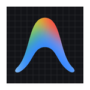

 

  

## 💡 About Me

- 🎓 **B.E. Computer Science Engineering** student
- 📊 Focused on **Data Analytics & Data Engineering**
- 🐍 Building with **Python & SQL**
- 📈 Comfortable with **Power BI, Excel, Pandas & NumPy**
- 🔄 Working with **ETL, data cleaning & data pipelines**
- 🤖 Shipping projects that combine **AI & APIs**
- 💻 Also work with **React & Vite**
- 👁️ Also worked with **OpenCV & YOLOv8**
- 🔧 Comfortable with **Git & GitHub**
- 🚀 Always looking to build practical, real-world projects
  

## 🛠 Tech Stack

### Languages

 

### Databases

 

### Data & Analytics

 

### Data Engineering

 

### Web & Cloud

 

### 🤖 AI & Computer Vision

 

### Tools
&nbsp;

## 📚 Currently Learning

| Area | Focus |
|:---:|:---:|
| 🗄️ SQL | Advanced SQL & query optimization |
| 🐍 Python | ETL & data processing |
| 🏗️ Data Engineering | Data warehousing & pipelines |
| 🔌 APIs | Data integration |
| 📊 Analytics | Advanced Power BI & DAX |

## 🚀 Featured Projects

<table align="center" width="100%">

<tr>
<td width="50%" valign="top">

### 🤖 AI Data Analyst Agent
AI-powered data analysis using natural language, SQL, Python, visualization and real datasets.

</td>
<td width="50%" valign="top">

### 📊 Brazilian E-Commerce Power BI Dashboard
Power BI dashboard for customer, sales, product and business analysis.

</td>
</tr>

<tr>
<td width="50%" valign="top">

### ⚖️ LexAI Dataset
Dataset collection, cleaning, transformation and preparation for an AI legal project.

</td>
<td width="50%" valign="top">

### 🌐 TamilVerse Dataset
Tamil language dataset collection, cleaning and structuring for AI applications.

</td>
</tr>

<tr>
<td width="50%" valign="top">

### 👁️ Helmet Detection
Computer vision project using YOLO and OpenCV for helmet detection.

</td>
<td width="50%" valign="top">

### 🌱 Smart Irrigation System
IoT-based irrigation system using sensors, ESP8266 and real-time environmental data.

</td>
</tr>

</table>

## 🐍 Contribution Snake

<picture>
  <source media="(prefers-color-scheme: dark)" srcset="https://raw.githubusercontent.com/DHARINEESHRK/DHARINEESHRK/output/github-contribution-grid-snake-dark.svg">
  <source media="(prefers-color-scheme: light)" srcset="https://raw.githubusercontent.com/DHARINEESHRK/DHARINEESHRK/output/github-contribution-grid-snake.svg">
  
</picture>

## 📈 GitHub Stats

  

### 👀 Profile Views

  

<i>Thanks for visiting — feel free to connect and collaborate! 🚀</i>

